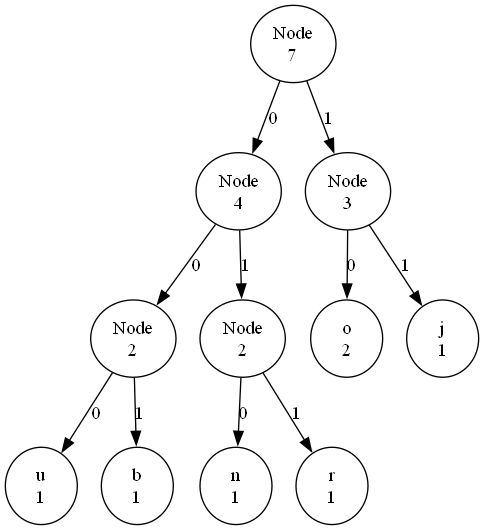

# L'Algorithme de Huffman : Compresser des Données !

### 1. Comprendre les Données

D'abord, l'algorithme regarde les choses que nous voulons compresser, comme un texte. Par exemple, si on a le mot **"banane"**, il va compter combien de fois chaque lettre apparaît. Voici ce qu'il trouve :

- **b** : 1 fois
- **a** : 3 fois
- **n** : 2 fois

### 2. Créer un Arbre Magique

Ensuite, l'algorithme construit un **arbre**. Imaginez un arbre où les feuilles sont les lettres. Les lettres qui apparaissent le plus souvent sont placées en haut, et celles qui apparaissent moins souvent sont plus bas. C'est comme un jeu où les lettres populaires se tiennent en avant !




### 3. Donner des Codes

Après cela, l'algorithme attribue des **codes** à chaque lettre. Les lettres qui apparaissent souvent, comme **"a"**, auront des codes plus courts, et celles qui apparaissent moins souvent, comme **"b"**, auront des codes plus longs. C'est comme si on donnait des surnoms aux lettres !

#### Exemple de Codes

- **a** = 0
- **n** = 10
- **b** = 110

### 4. Compresser le Texte

Maintenant, l'algorithme utilise ces codes pour remplacer les lettres du mot **"banane"** par leurs nouveaux codes. Voici ce que ça donne :

- "b" devient 110
- "a" devient 0
- "n" devient 10

Alors, **"banane"** devient **"1100101010"** ! C'est plus court, n'est-ce pas ?

### 5. Décompresser le Texte

Enfin, si on veut retrouver le mot original, l'algorithme peut utiliser l'arbre magique pour lire les codes et reconstruire le mot. En suivant les 0 et les 1, il sait comment remettre tout en ordre.

### En Résumé

L'algorithme de Huffman est un outil génial qui nous aide à rendre nos fichiers plus petits en utilisant des codes basés sur la fréquence des lettres. C'est comme un jeu de déduction avec des lettres et des nombres !

Et voilà, vous savez maintenant comment fonctionne cet algorithme ! Cool, non ?

### Nécessaire 

Installation de l'executable de [GraphVIZ](https://graphviz.org/download/) ou `winget install graphviz`

#### Comment se présente le projet :
```
projet-algorithme-gaetan-Algorithme-de-Compression-de-Huffman/
├── README.md
├── main.py
├── descriptions/
│   └── description_simple.md
├── implementations/
│   ├── implementation1.py
│   └── implementation2.py
├── tests/
│   ├── test_implementation1.py
│   └── test_implementation2.py
├── visualisations/
│   └── visualisation.py
├── analyses/
│   └── analyse_complexite.md
└── ressources/
    └── [données, images, etc.]
```

## Authors

- [@gaesty](https://www.github.com/gaesty)